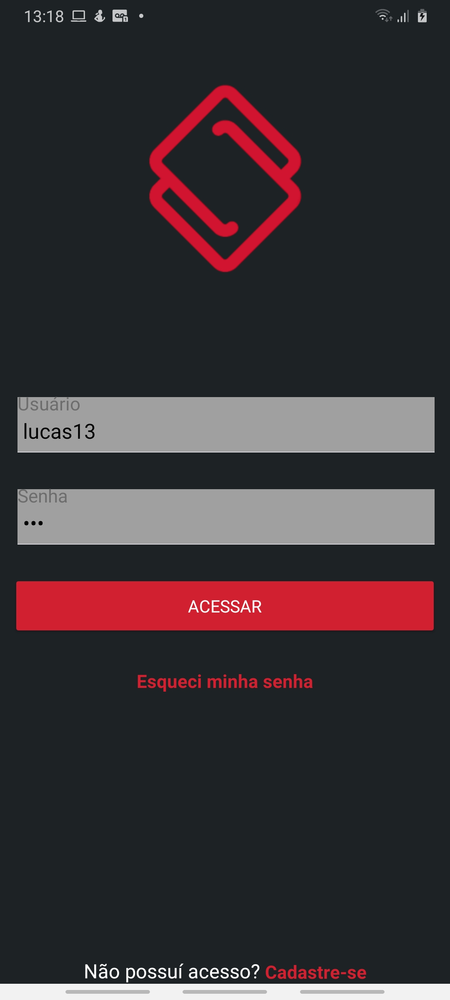
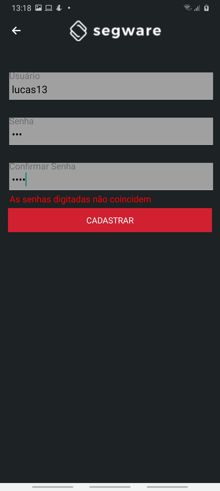
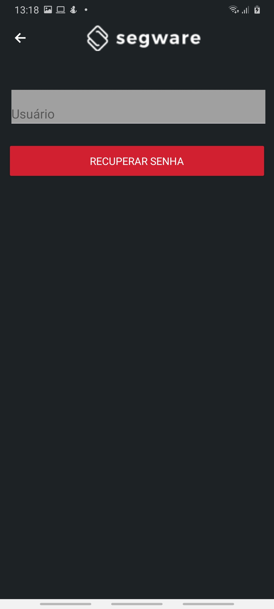
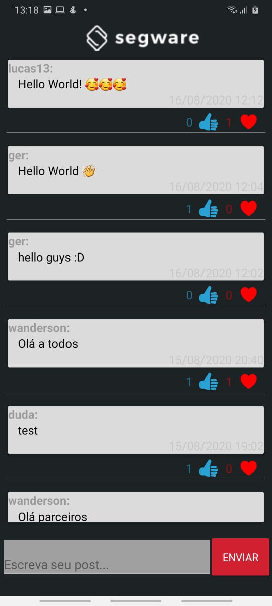

<h1 align="center">
 
  
 
 
</h1>

  1. Qual sua experiência com a linguagem JavaScript? Por favor, nomeie o principal projeto o qual você utilizou esta linguagem, os principais frameworks envolvidos e a arquitetura utilizada.

R: Trabalho com o javascript há 2 anos, os principais projetos que participei foram
para o segmento de pecuarista, garantindo o controle total do gado para o abate tanto para a empresa quanto para os pecuaristas.

2. Você possui experiência em alguma outra linguagem para back-end?

R: Sim, com NodeJS

3. Qual a sua experiência com tecnologias front-end como AngularJS e ReactJS?

R: Tenho experiêcnia de 1 ano com ReactJS.

4. Qual sua experiência com desenvolvimento para dispositivos móveis?

R: 1 ano, acredito que eu me classifique como um Dev Jr.

5. Qual sua experiência em virtualização de ambientes, exemplo: Docker?

R: utilizei docker em apenas um projeto, sou um pouco leigo no assunto, acredito
que a partir da documentação oficial, é possível aprender.

6. Quais foram seus cargos nos times que você contribuiu (considerando os seus últimos projetos/trabalhos que você trabalhou)? Qual era o tamanho destes times?

R: Full-Stack developer, utilizando React-Native, ReactJS e NodeJS.
Os times eram formados por 4 ou 5 integrantes.

  
  
  
  

<!-- What is: -->

## Technologies Used?

- _React-native:_ - Framework used in application development.
- _Redux:_ Library used to control application status.
- _Formik:_ Build forms in React, without the tears.
- _Moment:_ Parse, validate, manipulate, and display dates and times in JavaScript.
- _Axios:_ Http client based on promises for connection with api.
- _Eslint:_ Code analysis tool keeping the standards configured for application.

<!-- Links: -->

## Links

_React-native:_ (https://facebook.github.io/react-native/)

- _Redux:_ (https://redux.js.org/)
- _Formik:_ (https://formik.org/)
- _Axios:_ (https://github.com/axios/axios)
- _Eslint:_ (https://eslint.org/)
- _Moment:_ (https://momentjs.com/)

---

<!-- Get Started / Install: -->

## Getting started

Prerequisites: To run the react-native project on your mobile or emulator you need some
more specific settings, I recommend this link
(https://facebook.github.io/react-native/docs/getting-started) if you do not already have the recommended settings on your machine.

1. Install
   [Git](http://git-scm.com/downloads) e
   [NodeJS](http://nodejs.org/download/),
   in case you don't have them yet.

2. Clone repository:

   sh
   \$ git clone https://github.com/passeto/segwareApp.git

3) Go to project folder:

   sh
   \$ cd segwareApp

4. Install all dependences:

   sh
   \$ npm install or yarn

5) Finally run:

   sh
   $ react-native run-android (Android) or npx react-native run-android
   ou
   $ react-native run-ios (IOS) or npx react-native run-ios

Now you will see the app running on your mobile phone or emulator.
remember to enable the location of your smartphone :D

<!-- Create by: -->

## Who's behind this?

Developer passionate about programming and technologies.

_Create by_:

- [Luccas Passeto](http://github.com/passeto)
